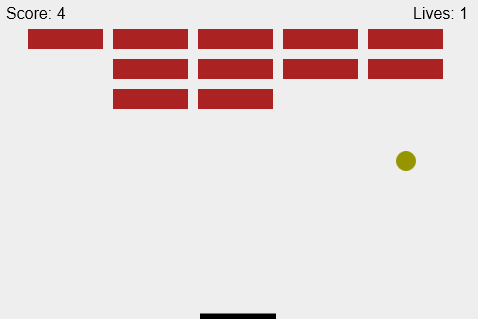

# HTML5/Javascript Game Development

---

# The Game

---

# 0. What you need
- Basic HTML5/CSS/Javascript knowledge
- Open mind, eager to learn

---

# 1. Draw objects

---

# The HTML5 Canvas

    !html
    <html>
    <head>
        <meta charset="utf-8" />
        <title>My HTML5 Canvas</title>
        
    </head>
    <body>

    <!-- The canvas element in which the game is drawn -->
    <canvas id="myCanvas" width="480" height="320"></canvas>

    </body>
    </html>

---

# Getting a handle in Javascript

    !javascript
    // Get a handle to the 2D context of the Canvas element
    let canvas = document.getElementById("myCanvas");
    let context = canvas.getContext("2d");

---

# Drawing various shapes - 1

    !javascript
    // Draw a line
    context.moveTo(200, 200);
    context.lineTo(300, 300);
    context.strokeStyle = "rgba(0, 0, 255, 0.5)";
    context.stroke();

---

# Drawing various shapes - 2

    !javascript
    // Draw a rectangle filled with color
    context.beginPath();
    context.rect(20, 40, 50, 50);
    context.fillStyle = "#FF0000";
    context.fill();
    context.closePath();

---

# Drawing various shapes - 3

    !javascript
    // Draw a circle
    context.beginPath();
    context.arc(240, 160, 20, 0, Math.PI*2);
    context.fillStyle = "green";
    context.fill();
    context.closePath();

    
