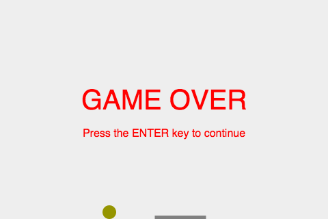

# HTML5/Javascript Game Development

---

# The Game

A simplified version of Breakout [https://en.wikipedia.org/wiki/Breakout_(video_game)](https://en.wikipedia.org/wiki/Breakout_(video_game))

---

# What you need
- Basic HTML5/CSS/Javascript knowledge
- Open mind, eager to learn

---

# What you will learn
- Build a simple yet full-fledged game in Javascript
- Essential elements in any game, such as animation, collision detection, building monsters (bricks), scoring, lives, winning/losing conditions
- Advanced Javascript concepts such as event handling, JSON, anonymous function

---

# Documentations
- W3School - HTML, CSS, Javascript searchable documentation at [https://www.w3schools.com/](https://www.w3schools.com/)
- MDN - Mozilla Developer Network searchable documentation on Web technology at [https://developer.mozilla.org/en-US/docs/Web](https://developer.mozilla.org/en-US/docs/Web)

---

# Directory structure

Use the following structure to keep things neat and allow for future expansion

    my_game_dir
     |
     |-- css
     |    |
     |    |-- main.css
     |
     |-- js
     |    |
     |    |-- main.js
     |
     |-- index.html

---

# 1. Draw objects

---

# The HTML5 Canvas

`index.html`

    !html
    <html>
    <head>
        <meta charset="utf-8" />
        <title>My HTML5 Canvas</title>
        <link rel="stylesheet" type="text/css" href="css/main.css">
    </head>
    <body>
    <!-- The canvas element in which the game is drawn -->
    <canvas id="myCanvas" width="480" height="320"></canvas>
    <!-- The script must come after the Canvas declaration -->
    
    </body>
    </html>

`css/main.css`

    !css
    * { padding: 0; margin : 0; } 
    canvas { background: #eee; display: block; margin: 0 auto; }

---

# Getting a handle in Javascript

`js/main.js`

    !javascript
    // Get a handle to the 2D context of the Canvas element
    let canvas = document.getElementById("myCanvas");
    let context = canvas.getContext("2d");

Canvas Coordinate System

---

# Drawing various shapes

    !javascript
    // Draw a line
    context.moveTo(200, 200);
    context.lineTo(300, 300);
    context.strokeStyle = "rgba(0, 0, 255, 0.5)";
    context.stroke();

    // Draw a rectangle filled with color
    context.beginPath();
    context.rect(20, 40, 50, 50);
    context.fillStyle = "#FF0000";
    context.fill();
    context.closePath();

    // Draw a circle
    context.beginPath();
    context.arc(240, 160, 20, 0, Math.PI*2);
    context.fillStyle = "green";
    context.fill();
    context.closePath();

---

# Drawing with different style

    !javascript
    // Draw a rectangle with border only
    context.beginPath();
    context.rect(160, 10, 100, 40);
    context.strokeStyle = "rgba(0, 0, 255, 0.5)";
    context.stroke();
    context.closePath();

---

# Drawing text

    !javascript
    // Write text
    context.font = "30px Arial";
    context.textAlign = "left"
    context.fillStyle = "black";
    context.fillText("Hello World", 150, 200);

---

# Checkpoint 1

---

# Exercise 1

Functions allow us to reuse code (and type less!). Create the following functions using the signatures provided, and use them.

    !javascript
    function drawRect(ctx, x, y, width, height, fillStyle, strokeStyle)
    {
        ...
    }

    function drawCircle(ctx, x, y, radius, fillStyle, strokeStyle)
    {
        ...
    }

    function writeText(ctx, text, x, y, alignment, font, fillStyle)
    {
        ...
    }

---

# 2. Move objects

---

# Draw loop

The perception of motion is achieved by exploiting the [Phi Phenomenon](https://en.wikipedia.org/wiki/Phi_phenomenon).

In game dev, we use a draw loop:

    !javascript
    function draw(param1, param2, ...)
    {
        ...
    }

    window.setInterval(draw, 10, param1, param2, ...);

`window.setInterval()` [documentation](https://www.w3schools.com/jsref/met_win_setinterval.asp)

_Quiz: what is the frame rate in the above draw loop?_

---

# Moving the ball - 1

What is the ball's starting location?

    !javascript
    // Ball's initial location
    let xBall = canvas.width / 2;
    let yBall = canvas.height - 30;

What is the ball's size and color?

    !javascript
    const COLOR_BALL_FILL_STYLE = "#959500";
    const SIZE_BALL_RADIUS      = 10;

Draw the ball

    !javascript
    drawCircle(context, xBall, yBall, 
               SIZE_BALL_RADIUS, COLOR_BALL_FILL_STYLE, "");

---

# Moving the ball - 2

    !javascript
    /**
     * Main draw loop of the game
     * @param {object} ctx The 2D context of a Canvas
     */
    function main(ctx)
    {
        drawCircle(ctx, xBall, yBall, 
                   SIZE_BALL_RADIUS, COLOR_BALL_FILL_STYLE, "");
    }

    window.setInterval(main, 10, context);

---

# Moving the ball - 3

Update the ball's position by adding small offsets to its x- and y-coordinates. In physics, they are called velocities.

    !javascript
    // Ball's initial velocities
    let xBallVelocity =  2;
    let yBallVelocity = -2;

    /**
     * Update the ball's current status
     */
    function updateBall()
    {
        xBall += xBallVelocity;
        yBall += yBallVelocity;
    }

_Quiz: what is the angle of movement implied by the initial velocities?_

---

# Moving the ball - 4 _What's Wrong?_

    !javascript
    function main(ctx)
    {
        drawCircle(ctx, xBall, yBall, 
                   SIZE_BALL_RADIUS, COLOR_BALL_FILL_STYLE, "");
        updateBall();
    }

    window.setInterval(main, 10, context);

---

# Moving the ball - 5

Clear the canvas!

    !javascript
    function main(ctx)
    {
        ctx.clearRect(0, 0, ctx.canvas.width, ctx.canvas.height);
        drawCircle(ctx, xBall, yBall, 
                   SIZE_BALL_RADIUS, COLOR_BALL_FILL_STYLE, "");
        updateBall();
    }
---

# Bouncing off walls - detection

Against right wall

    !javascript
    xBall + SIZE_BALL_RADIUS + xVelocity >= ctx.canvas.width

Against left wall

    !javascript
    xBall - SIZE_BALL_RADIUS + xVelocity <= 0

Against top wall

    !javascript
    yBall - SIZE_BALL_RADIUS + yVelocity <= 0

Against bottom wall

    !javascript
    yBall + SIZE_BALL_RADIUS + yVelocity >= ctx.canvas.height

---

# Bouncing off walls - reflection

Against right and left walls

    !javascript
    xVelocity = -xVelocity;

Against top and bottom walls

    !javascript
    yVelocity = -yVelocity;

---

# Bouncing off walls - putting it together

    !javascript
    /**
     * Update the ball's current status
     * @param {object} ctx  The 2D context of a Canvas
     */
    function updateBall(ctx)
    {
        // change direction of velocity when hitting the wall
        if ( xBall + xBallVelocity > (ctx.canvas.width - SIZE_BALL_RADIUS) || 
             xBall + xBallVelocity < SIZE_BALL_RADIUS ) 
        {
            xBallVelocity = -xBallVelocity;
        }
        if ( yBall + yBallVelocity > (ctx.canvas.height - SIZE_BALL_RADIUS) || 
             yBall + yBallVelocity < SIZE_BALL_RADIUS ) 
        {
            yBallVelocity = -yBallVelocity;
        }

        // update ball's location
        xBall += xBallVelocity;
        yBall += yBallVelocity;
    }

---

# Checkpoint 2

---

# Exercise 2

Make the ball change color when it bounces off a wall.

---

# 3. Process user input

---

# Drawing the paddle - 1

    !javascript
    // Paddle color and sizes
    const COLOR_PADDLE_FILL_STYLE = "#808080"
    const SIZE_PADDLE_HEIGHT      =  5;
    const SIZE_PADDLE_WIDTH       = 75;

    // Paddle's initial location
    let xPaddle = (canvas.width - SIZE_PADDLE_WIDTH)/2;
    let yPaddle = canvas.height - SIZE_PADDLE_HEIGHT;

    function main(ctx)
    {
        ...
        // draw the paddle
        drawRect(ctx, xPaddle, yPaddle, 
                SIZE_PADDLE_WIDTH, SIZE_PADDLE_HEIGHT,
                COLOR_PADDLE_FILL_STYLE, "");
    }

---

# Drawing the paddle - 2

---

# Registering event handlers

`document.addEventlistener()` [documentation](https://www.w3schools.com/jsref/met_document_addeventlistener.asp)

    !javascript
    // register keyboard and mouse event handlers
    document.addEventListener("keydown",   keyDownHandler,   false);
    document.addEventListener("keyup",     keyUpHandler,     false);
    document.addEventListener("mousemove", mouseMoveHandler, false);

---

# Responding to key presses - 1

    !javascript
    let isKeyRightPressed = false;
    let isKeyLeftPressed  = false;

    /**
     * Handles a KeyDown event
     * @param {object} evt KeyDown event 
     */
    function keyDownHandler(evt)
    {
        switch(evt.key)
        {
            case "ArrowRight":
            case "Right":
                isKeyRightPressed = true;
                break;

            case "ArrowLeft":
            case "Left":
                isKeyLeftPressed = true;
                break;
        }
    }

---

# Exercise 3

Write the `keyUpHandler()` function.

_Hint: mimic `keyDownHandler()`._

---

# Responding to key presses - 2

    !javascript
    /**
     * Handles a KeyUp event
     * @param {object} evt KeyUp event 
     */
    function keyUpHandler(evt)
    {
        switch(evt.key)
        {
            case "ArrowRight":
            case "Right":
                isKeyRightPressed = false;
                break;

            case "ArrowLeft":
            case "Left":
                isKeyLeftPressed = false;
                break;
        }
    }

List of Key Values [here](https://developer.mozilla.org/en-US/docs/Web/API/KeyboardEvent/key/Key_Values)

---

# Moving the paddle with the keyboard

    !javascript
    // how much the paddle moves when key is depressed
    const SIZE_PADDLE_NUDGE = 7;
    
    /**
     * Update the paddle's current status
     */
    function updatePaddle()
    {
        if ( isKeyRightPressed ) 
        {
            xPaddle += SIZE_PADDLE_NUDGE;
        }
        else if ( isKeyLeftPressed ) 
        {
            xPaddle -= SIZE_PADDLE_NUDGE;
        }
    }

---

# Keeping it within the canvas

    !javascript
    function updatePaddle(ctx)
    {
        if ( isKeyRightPressed && 
            xPaddle < ctx.canvas.width - SIZE_PADDLE_WIDTH ) 
        {
            xPaddle += Math.abs(xPaddleNudge);
        }
        else if ( isKeyLeftPressed && 
                 xPaddle > 0 ) 
        {
            xPaddle -= Math.abs(xPaddleNudge);
        }
    }

    function main(ctx)
    {
        ...
        updateBall(ctx);
        updatePaddle(ctx);
    }

---

# Controlling it with the mouse - 1

##Key issue 

How to obtain the relative position of the pointer _within_ the canvas?

## Solution

    !javascript
    let relativeX = MOUSE_EVENT.clientX - canvas.offsetLeft;

---

# Controlling it with the mouse - 2

    !javascript
    /**
     * Handles a MouseMove event
     * @param {object} evt MouseMove event
     */
    function mouseMoveHandler(evt) 
    {
        let relativeX = evt.clientX - canvas.offsetLeft;
        let outLeft  = relativeX - SIZE_PADDLE_WIDTH/2 <= 0;
        let outRight = relativeX >= canvas.width - SIZE_PADDLE_WIDTH/2;
        if ( !outLeft && !outRight ) 
        {
            xPaddle = relativeX - SIZE_PADDLE_WIDTH/2;
        }
        else if ( outLeft )
        {
            xPaddle = 0;
        }
        else if ( outRight )
        {
            xPaddle = canvas.width - SIZE_PADDLE_WIDTH;
        }
    }

---

# Checkpoint 3

---

# 4. End and restart game

---

# Losing the game - 1

Game is lost when ball hits the lower wall (ignore the paddle for now).

Modify the `updateBall()` function to detect this condition.

---

# Exercise 4

    !javascript
    let isGameOver = false;

    function updateBall(ctx)
    {
        /* Define the isHitting* variables here */

        if ( isHittingRightWall || isHittingLeftWall ) 
        {
            xBallVelocity = -xBallVelocity;
        }
        if ( isHittingUpperWall )
        {
            yBallVelocity = -yBallVelocity;
        }
        else if ( isHittingLowerWall )
        {
            isGameOver = true;
        }

        xBall += xBallVelocity;
        yBall += yBallVelocity;
    }

---

# Losing the game - 2

Answer to Exercise 4

    !javascript
    let isHittingRightWall = (xBall + xBallVelocity > 
                              (ctx.canvas.width - SIZE_BALL_RADIUS));
    let isHittingLeftWall  = (xBall + xBallVelocity < SIZE_BALL_RADIUS);
    let isHittingUpperWall = (yBall + yBallVelocity < SIZE_BALL_RADIUS);
    let isHittingLowerWall = (yBall + yBallVelocity > 
                              (ctx.canvas.height - SIZE_BALL_RADIUS));

---

# Restarting the game - the steps

The sequence of events when game is over is

1. `window.clearInterval()` is called to stop the game
2. player is asked to press `ENTER` key to continue
3. when `ENTER` key is pressed, game is restarted by calling `window.setInterval()`

---

# Restarting the game - step 1

Stop the draw loop using `window.clearInterval()`. [documentation](https://www.w3schools.com/jsref/met_win_clearinterval.asp)

    !javascript
    let mainGame = window.setInterval(main, 10, context);

    function main(ctx)
    {
        ...

        if (isGameOver)
        {
            window.clearInterval(mainGame);
        }
    }

---

# Restarting the game - step 2

Prompt player to press the `ENTER` key

    !javascript
    function main(ctx)
    {
        ...

        if (isGameOver)
        {
            window.clearInterval(mainGame);
            writeText(ctx, "GAME OVER", 
                      ctx.canvas.width/2, ctx.canvas.height/2, 
                      "center", "40px Helvetica", "red");
            writeText(ctx, "Press the ENTER key to continue", 
                      ctx.canvas.width/2, ctx.canvas.height/2+40, 
                      "center", "12pt Helvetica", "red");
        }
    }

---

# Restarting the game - step 3

Restart game when `ENTER` is pressed

    !javascript
    function keyUpHandler(evt)
    {
        switch(evt.key)
        {
            ...
            case "Enter":
                if (isGameOver)
                {
                    /* a. Reset game state, e.g. win/lose, score */

                    /* b. Reset ball and paddle states */

                    mainGame = window.setInterval(main, 10, context);
                    return;
                }
                break;
        }
    }

---

# A bit of code refactoring

Code refactorization helps avoid code duplication.

- refactor code that initialize game states into one function
- refactor code that initialize ball and paddle states into one function

---

# Restarting the game - step 3a

    !javascript
    let isGameOver;

    function resetGame()
    {
        isGameOver = false;
    }

---

# Restarting the game - step 3b

    !javascript
    let xBall, yBall;
    let xBallVelocity, yBallVelocity;
    let xPaddle, yPaddle;

    /**
     * Initialize ball and paddle position
     * @param {object} ctx The 2D context of a Canvas
     */
    function initBallPaddle(ctx)
    {
        xBall = ctx.canvas.width / 2;
        yBall = ctx.canvas.height - 30;

        xPaddle = (ctx.canvas.width - SIZE_PADDLE_WIDTH)/2;
        yPaddle = ctx.canvas.height - SIZE_PADDLE_HEIGHT;

        xBallVelocity =  2;
        yBallVelocity = -2;
    }

---

# Restarting the game - step 3 completed

    !javascript

    resetGame();
    initBallPaddle(context);
    mainGame = window.setInterval(main, 10, context);
    ...

    function keyUpHandler(evt)
    {
        switch(evt.key)
        {
            ...
            case "Enter":
                if (isGameOver)
                {
                    resetGame();
                    initBallPaddle(context);
                    mainGame = window.setInterval(main, 10, context);
                    return;
                }
                break;
        }
    }

---

# Losing the game - 3 _finally_

Now we take into consideration the paddle's position.

    !javascript
    function updateBall(ctx)
    {
        ...
        else if (isHittingLowerWall)
        {
            // ball is at the lower boundary of the canvas
            // is it hitting the paddle?
            let isPaddleInRange = (xBall >= xPaddle && 
                                   xBall <= xPaddle + SIZE_PADDLE_WIDTH);
            if (isPaddleInRange)
            {
                // treat the paddle like a wall
                yBallVelocity = -yBallVelocity;
            }
            else
            {
                isGameOver = true;
            }
        }
    }

---

# Checkpoint 4

---

# 5. Add monsters (or bricks)

---

# The brick object

In Javascript, objects are created in the JSON (JavaScript Object Notation) format. [A primer on JSON](https://adobe.github.io/Spry/articles/json_primer/json_primer.html)

    !javascript
    brick = {
                x     : 10,    // x-coordinate
                y     : 20,    // y-coordinate
                isHit : false  // has it been hit?
            }

A few constants on bricks

    !javascript
    const SIZE_BRICK_HEIGHT        = 20;
    const SIZE_BRICK_WIDTH         = 75;
    const SIZE_BRICK_WALL_GAP_TOP  = 30;
    const SIZE_BRICK_WALL_GAP_LEFT = 30; 
    const SIZE_BRICK_BRICK_GAP     = 10;
    const COLOR_BRICK_FILL_STYLE   = "#AA2222";
---

# Building a matrix of them

    !javascript
    const SIZE_NUM_ROWS_BRICKS     =  5;
    const SIZE_NUM_COLS_BRICKS     =  3;
    /**
     * Build a 2D matrix (array of arrays) of bricks
     * @returns {array} a 2D matrix of bricks
     */
    function buildBricks()
    {
        let returnValue = [];
        for(let c = 0; c < SIZE_NUM_COLS_BRICKS; c++) {
            returnValue[c] = [];
            for(let r = 0; r < SIZE_NUM_ROWS_BRICKS; r++) {
                let xBrick = (r*(SIZE_BRICK_WIDTH  + SIZE_BRICK_BRICK_GAP)) + 
                              SIZE_BRICK_WALL_GAP_LEFT;
                let yBrick = (c*(SIZE_BRICK_HEIGHT + SIZE_BRICK_BRICK_GAP)) + 
                              SIZE_BRICK_WALL_GAP_TOP;
                let brick = {x: xBrick, y: yBrick, isHit: false};
                returnValue[c][r] = brick;
            }
        }
        return returnValue;
    }

---

# Drawing them

    !javascript
    let bricks = buildBricks();

    /**
     * Draw bricks - only unhit bricks are drawn
     * @param {object} ctx 2D context of a Canvas
     */
    function drawBricks(ctx)
    {
        for(let c = 0; c < SIZE_NUM_COLS_BRICKS; c++)
        {
            for(let r = 0; r < SIZE_NUM_ROWS_BRICKS; r++)
            {
                let brick = bricks[c][r];
                if (!brick.isHit)
                    drawRect(ctx, brick.x, brick.y, 
                             SIZE_BRICK_WIDTH, SIZE_BRICK_HEIGHT, 
                             COLOR_BRICK_FILL_STYLE, "");
            }
        }
    }

---

# Detecting a hit - 1

Ball can hit brick on any of its four sides. 

- When the top or bottom side is hit, `yBallVelocity` changes direction
- When the left or right side is hit, `xBallVelocity` changes direction

---

# Detecting a hit - 2

    !javascript
    /**
     * Update bricks status - if any of the brick is hit
     */
    function updateBricks()
    {
        for(let c = 0; c < SIZE_NUM_COLS_BRICKS; c++) {
            for(let r = 0; r < SIZE_NUM_ROWS_BRICKS; r++) {
                let b = bricks[c][r];
                if(b.isHit == false) {
                    /* Define isHitFromTopOrBottom and isHitFromLeftOrRight */ 
                    if (isHitFromTopOrBottom)
                    {
                        yBallVelocity = -yBallVelocity; b.isHit = true;
                    }
                    else if (inHitFromLeftOrRight)
                    {
                        xBallVelocity = -xBallVelocity; b.isHit = true;
                    }                  
                }
            }
        }
    }

---

# Detecting a hit - 3 

When hit from top or bottom

    !javascript
    let xInRange = (xBall >= b.x && 
                    xBall <= b.x + SIZE_BRICK_WIDTH);

    let yInRangeFromTop    
        = ((yBall + SIZE_BALL_RADIUS) >= b.y && 
           (yBall + SIZE_BALL_RADIUS) <  b.y + SIZE_BRICK_HEIGHT);
    
    let yInRangeFromBottom 
        = ((yBall - SIZE_BALL_RADIUS) >  b.y && 
           (yBall - SIZE_BALL_RADIUS) <= b.y + SIZE_BRICK_HEIGHT);
 
    let isHitFromTopOrBottom = (xInRange && 
                                (yInRangeFromTop || yInRangeFromBottom));

---

# Exercise 5

Write code to compute `isHitFromLeftOrRight`.

---

# Detecting a hit - 4 

Answer to Exercise 5 - when hit from left or right

    !javascript
    let yInRange = (yBall >= b.y && 
                    yBall <= b.y + SIZE_BRICK_HEIGHT);

    let xInRangeFromLeft  
        = ((xBall + SIZE_BALL_RADIUS) >= b.x &&
           (xBall + SIZE_BALL_RADIUS) <  b.x + SIZE_BRICK_WIDTH);

    let xInRangeFromRight 
        = ((xBall - SIZE_BALL_RADIUS) >  b.x &&
           (xBall - SIZE_BALL_RADIUS) <= b.x + SIZE_BRICK_WIDTH);

    let inHitFromLeftOrRight = (yInRange && 
                                (xInRangeFromLeft || xInRangeFromRight));

---

# Putting it in the draw loop

    !javascript
    function main(ctx)
    {
        ctx.clearRect(0, 0, ctx.canvas.width, ctx.canvas.height);

        drawBricks(ctx);
        
        ...

        if (isGameOver)
        {
            ...
        }

        updatePaddle(ctx);

        updateBricks();
    }

---

# Rebuilding the bricks before restarting

    !javascript
    function keyUpHandler(evt)
    {
        ...
            case "Enter":
                if (isGameOver)
                {
                    resetGame();
                    bricks = buildBricks();
                    initBallPaddle(context);
                    mainGame = window.setInterval(main, 10, context);
                    return;
                }
                break;
    }

---

# Checkpoint 5

---

# 6. Keep track of score, lives

---

# Adding more game states

    !javascript
    // is Game Over?
    let isGameOver;

    // number of bricks hit so far
    let numBricksHit;

    // number of lives left
    let numLives;

    // has player won?
    let isGameWon;

    ...

    function resetGame()
    {
        isGameOver    = false;
        numBricksHit  =  0;
        numLives      =  3;
        isGameWon     = false;
    }

---

# Keeping track of score

    !javascript
    function updateBricks()
    {
        ...
        if (xInRange && (yInRangeFromTop || yInRangeFromBottom))
        {
            yBallVelocity = -yBallVelocity;
            b.isHit = true;
            numBricksHit ++;
        }
        else if (yInRange && (xInRangeFromLeft || xInRangeFromRight))
        {
            xBallVelocity = -xBallVelocity;
            b.isHit = true;
            numBricksHit ++;
        }             
    }

---

# Keeping track of lives - 1 _What's wrong?_

    !javascript
    function updateBall(ctx)
    {
            if (isPaddleInRange)
            ...
            else
            {
                numLives --;
                if (numLives == 0)
                {
                    isGameOver = true;
                }
                else
                {
                    window.clearInterval(mainGame);
                    writeText(ctx, "Live(s) left: " + numLives, 
                              ctx.canvas.width/2, ctx.canvas.height/2, 
                              "center", "40px Helvetica", "red");
                    initBallPaddle(ctx);
                    mainGame = window.setInterval(main, 10, ctx);
                }
            }
    }

---

# Keeping track of lives - 2

Use `window.setTimeout()` to delay the execution of a function. [documentation](https://www.w3schools.com/jsref/met_win_settimeout.asp)

To turn a statement into a function, we wrap it in an _anonymous function_.

    !javascript
    window.setTimeout(function(c)
                      { 
                          mainGame = window.setInterval(main, 10, c);
                      }, 
                      2000, 
                      context);
---

# Displaying score and lives

    !javascript
    function main(ctx)
    {
        ...
        /* after drawing the ball and paddle */

        // draw the score
        writeText(ctx, "Score: " + numBricksHit, 8, 20, 
                  "left", "16px Helvetica", "black");

        // draw number of lives remaining
        writeText(ctx, "Lives: " + numLives, ctx.canvas.width-65, 20, 
                  "left", "16px Helvetica", "black");

        ...
    }

---

# Winning the game - 1

    !javascript
    function main(ctx)
    {
        ...
        // check game-won condition
        if (isGameWon)
        {
            window.clearInterval(mainGame);
            writeText(ctx, "You Won!", 
                    ctx.canvas.width/2, ctx.canvas.height/2, "center", "40px Helvetica", "red");
            writeText(ctx, "Press the ENTER key to continue", 
                    ctx.canvas.width/2, ctx.canvas.height/2+40, "center", "12pt Helvetica", "red");        
        }
        updateBall(ctx);
        ...
        updateBricks(ctx);

        if (numBricksHit == SIZE_NUM_COLS_BRICKS * SIZE_NUM_ROWS_BRICKS)
            isGameWon = true;
    }

---

# Winning the game - 2

    !javascript
    function keyUpHandler(evt)
    {
        ...
            case "Enter":
                if (isGameOver || isGameWon)
                {
                    resetGame();
                    bricks = buildBricks();
                    initBallPaddle(context);
                    mainGame = window.setInterval(main, 10, context);
                    return;
                }
                break;
    }

---

# Checkpoint 6

---

# The END :-)

---